![GreyScript](https://img.shields.io/badge/GreyScript-Prime-black?labelColor=blue&style=for-the-badge&logo=data:image/png;base64,iVBORw0KGgoAAAANSUhEUgAAABAAAAAQCAYAAAAf8/9hAAAC+ElEQVQ4T22T+0tTYRjHv+/u05h4KxsqW1qiiRmZEQZpCUsUJIWMJCL7IUsiCvqlftkP/gcZQr+EeClETCyk6KI/GJWSihdS58LrNnVTNy/b3M45Pe9sy6AHznue57zP+znP7WXYJ5IEGYZxBhKqSSukd3pom2GG1j6yW3ES3xmDGD7Gwoo0ilgIqKetGgnQCIIcQoBBIFelUoSCHnL20fICCjxhOVjfY5OEDgfRRqopGJCziYGjmJ82wOdVYcrhgEoTQM6JZRQVO6BWi8THe4Jc4xD2J+wG+lhLOhvpz4JXfQsZpnKotFFYcfuw43FjsKsFSewVSsqXwOSUDEMjcnGPSUM4S+Zn+qDZ9SvQ1VKK1awKMKUCVZWlcK5vobnlJQS/H9qx13h0YwRao8Bj5+lcYNIwGghQx1Nxuw6gu70E80eK4A/uwmg4DLvdAat1Diq5ErEzfbhfNopDBi+gDxXgGQeME+A4BywvxKO3swDplyqQWVKO1bUNLLs8SIiNw0BnM8bedaDGZEG6fhOIoQN6TPAUfKSqOWB2So+vPaeILIMqKhqQK0JFDOz64dveomqLqDo/i9y0UAMAHfwcQPFAw+2pYSOG+rLDzaEWivhpt0Ok6oalLH8BBdmrYTPAAeNkhVIY/ZKBiYGMiPP/AIU5DpjybHs+DJNM+kFFZKjjPxn8lAPrmCEC4OM2abMhSJGE5fQxJy4XzIOmkUtjpI18+vrf5GHRqodMIUdM4kGoo6OxZLHAvbMDh9sdAmWmbuD6xV8cwNtYvDdII3gqCezOh/YC5rLHIT45GVE6HURBgG16GhI5ebxezLpcSEncRm3ZtCSTSc/phtyNjLLgk7f1NBWafP44lmQ0UiNk/wB4IWdWVqBVbUsPKic+KqOlq+wK1iKXae5tTOy3jnP1So3uZkJqqpbxK7cvAh7FrNPl8wa8TbdLrY9THnrW9uq4T8xmsyzfs5ivS0yoppoUiYKYZrNY5JIkWMmx17mx2erq7v1qxt/r/BtM3mB6tGkzRAAAAABJRU5ErkJggg==&logoColor=white)

GreyScript Prime is an extension for **Grey Script** that adds additional methods for object manipulation. With the combination of `Greybel VS`, `Plant UML`, and `Markdown Preview Enhanced with litvis`, this tool is designed to enhance your coding efficiency in **VSCode**.

[`Example Screenshot`](#example) 

Limited custom formatting of DocBlocks and Plant UML allow for insertion to GreyScript Compiler.
***
# GreyScript Prime 

# 📄 Methods Overview

## stringMethods

### TextMeshPro

#### .align
##### *[align-tmpdocs](https://docs.unity3d.com/Packages/com.unity.textmeshpro@4.0/manual/RichTextAlignment.html)*
The .align method allows you to apply the align tag to the given text.
Accepted values: `left`, `right`, `center`, `justified`, and `flush`

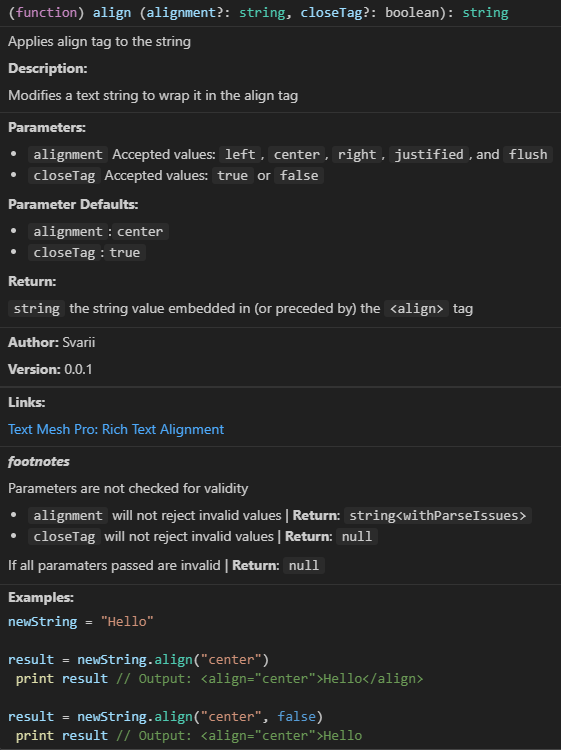


```
newString = "Hello"

print(newString.align) // Outputs: <align="center">Hello</align>
```

#### .alpha
##### *[alpha-tmpdocs](https://docs.unity3d.com/Packages/com.unity.textmeshpro@4.0/manual/RichTextOpacity.html)*
The `.alpha` method sets the opacity of using a 2 digits hex value


\#FF: 100% Opague
\#00: 100% Transparent

#### .bold
##### *[bold-tmpdocs](https://docs.unity3d.com/Packages/com.unity.textmeshpro@4.0/manual/RichTextBoldItalic.html)*
The `.bold` method allows you to apply bold to the given text.

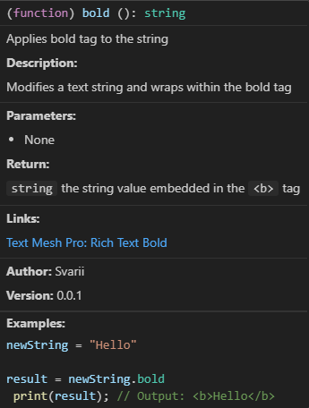

```
newString = "Hello"

print(newString.bold) // Outputs: <b>Hello</b>
```
#### .color
##### *[color-tmpdocs](https://docs.unity3d.com/Packages/com.unity.textmeshpro@4.0/manual/RichTextColor.html)*
##### *[color-names-extended](https://htmlcolorcodes.com/color-names/)*
The `.color` method allows you to apply a color to the given text.


```
newString = "Hello"

print(newString.color("blue")) // Outputs: <color=blue>Hello</color>
```

#### .cspace
##### *[cspace-tmpdocs](https://docs.unity3d.com/Packages/com.unity.textmeshpro@4.0/manual/RichTextCharacterSpacing.html)*
The `.cspace` method allows you to adjust character spacing, either absolute or relative to the original font Asset. You can use pixels or font units.

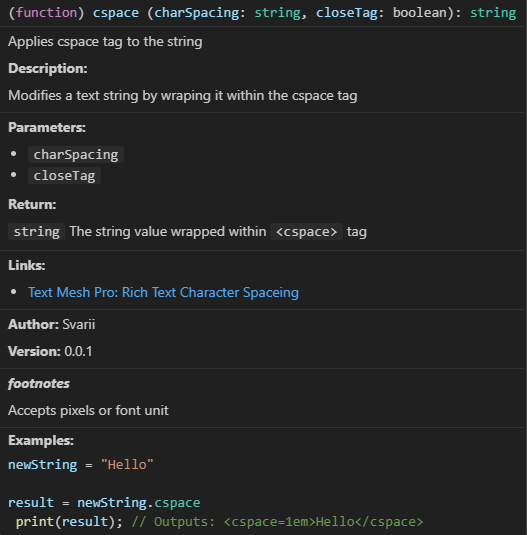

#### .indent
##### *[indent-tmpdocs](https://docs.unity3d.com/Packages/com.unity.textmeshpro@4.0/manual/RichTextIndentation.html)*
The `.indent` method controls the horizontal caret position the same way the <pos> tag does, but the effect persists across lines.

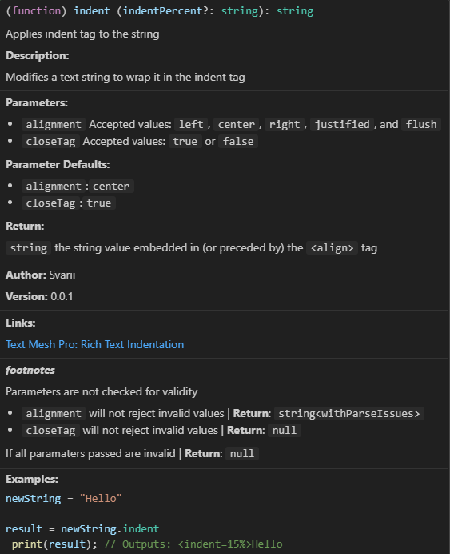


#### .italic
##### *[italic-tmpdocs](https://docs.unity3d.com/Packages/com.unity.textmeshpro@4.0/manual/RichTextBoldItalic.html)*
The `.italic` method allows you to apply italic to the given text.


```
newString = "Hello"

print(newString.italic) // Outputs: <i>Hello</i>
```

#### .line-indent
##### *[line-indent-tmpdocs](https://docs.unity3d.com/Packages/com.unity.textmeshpro@4.0/manual/RichTextLineIndentation.html)*
The .line-indent method inserts horizontal space directly after it, and before the start of each new line. It only affects manual line breaks (including line breaks created with the \<br> tag, not word-wrapped lines.

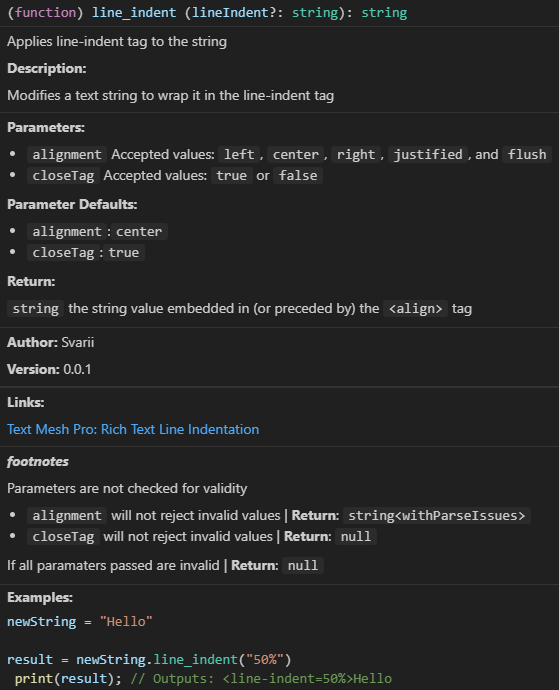


You can specify the indentation in pixels, font units, or percentages.

#### .lowercase
##### *[lowercase-tmpdocs](https://docs.unity3d.com/Packages/com.unity.textmeshpro@4.0/manual/RichTextLetterCase.html)*
The .lowercase method alters the capitalization of your text before rendering. The text in the Text field remains as you entered it.

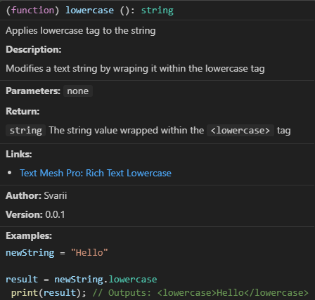

#### .margin
##### *[margin-tmpdocs](https://docs.unity3d.com/Packages/com.unity.textmeshpro@4.0/manual/RichTextMargins.html)*
You can increase the horizontal margins of the text with the .margin method.
You can specify the margins in pixels, font units, and percentages.
Negative values have no effect.

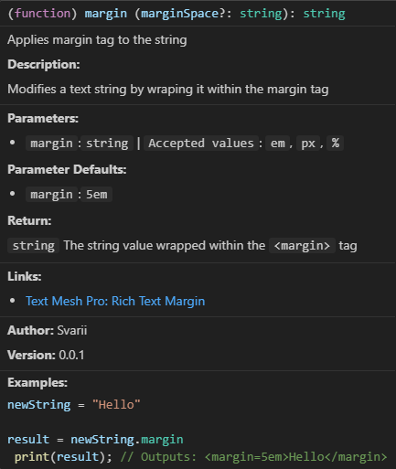


#### .mark
##### *[mark-tmpdocs](https://docs.unity3d.com/Packages/com.unity.textmeshpro@4.0/manual/RichTextMark.html)*
The `.mark` method allows you to apply highlight to the given text.

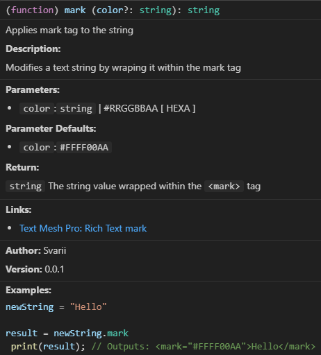

```
newString = "Hello"

print(newString.mark) // Outputs: <mark>Hello</mark>
```

#### .mspace
##### *[mspace-tmpdocs](https://docs.unity3d.com/Packages/com.unity.textmeshpro@4.0/manual/RichTextMonospace.html)*

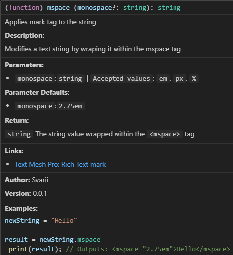


#### .nobr
##### *[nobreak-tmpdocs](https://docs.unity3d.com/Packages/com.unity.textmeshpro@4.0/manual/RichTextNoBreak.html)*

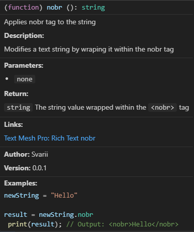


#### .noparse
##### *[noparse-tmpdocs](https://docs.unity3d.com/Packages/com.unity.textmeshpro@4.0/manual/RichTextNoParse.html)*

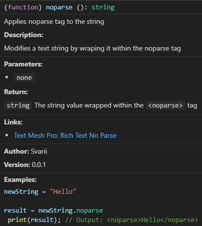


#### .page
##### *[page-tmpdocs](https://docs.unity3d.com/Packages/com.unity.textmeshpro@4.0/manual/RichTextPageBreak.html)*

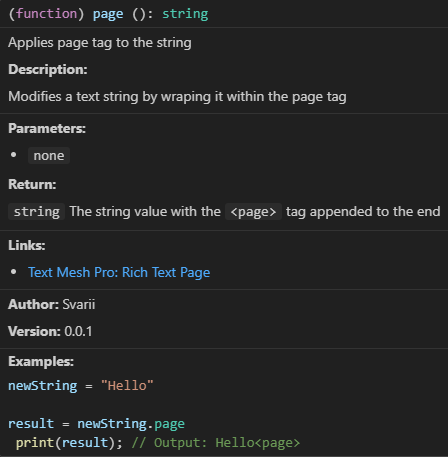


#### .pos
##### *[pos-tmpdocs](https://docs.unity3d.com/Packages/com.unity.textmeshpro@4.0/manual/RichTextPage.html)*

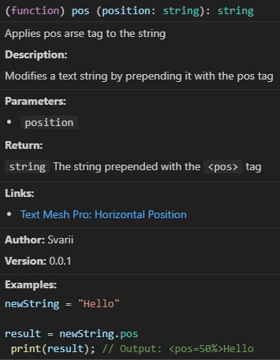

#### .rotate
##### *[rotate-tmpdocs](https://docs.unity3d.com/Packages/com.unity.textmeshpro@4.0/manual/RichTextRotate.html)*

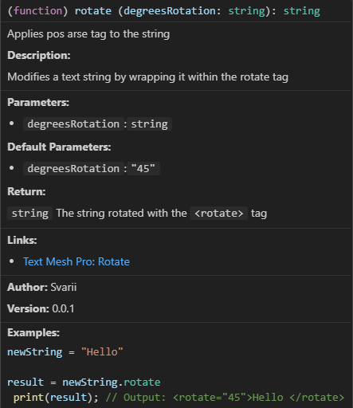

#### .size
##### *[size-tmpdocs](https://docs.unity3d.com/Packages/com.unity.textmeshpro@4.0/manual/RichTextSize.html)*

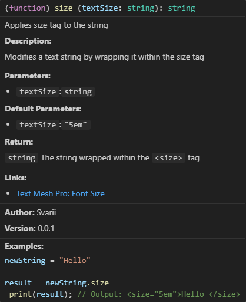

#### .strike
##### *[strike-tmpdocs](https://docs.unity3d.com/Packages/com.unity.textmeshpro@4.0/manual/RichTextStrikethroughUnderline.html)*
The `.strike` method allows you to apply strikethrough to the given text.

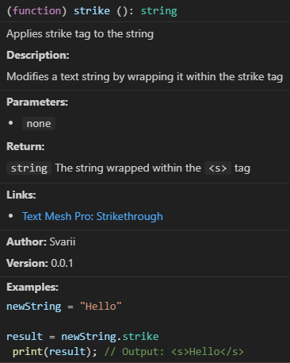

```
newString = "Hello"

print(newString.strike) // Outputs: <s>Hello</s>
```

#### .sub
##### *[sub-tmpdocs](https://docs.unity3d.com/Packages/com.unity.textmeshpro@4.0/manual/RichTextSubSuper.html)*
The `.sub` method allows you to apply subscript to the given text. Example usage:

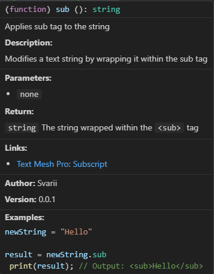

```
newString = "Hello"

print(newString.tiny) // Outputs: <sub>Hello</sub>
```

#### .sup
##### *[sup-tmpdocs](https://docs.unity3d.com/Packages/com.unity.textmeshpro@4.0/manual/RichTextSubSuper.html)*
The `.sup` method allows you to apply superscript to the given text. Example usage:

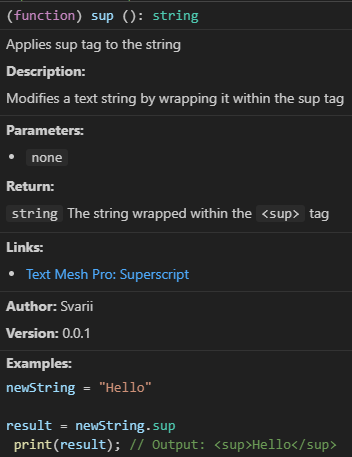

```
newString = "Hello"

print(newString.sup) // Outputs: <sup>Hello</sup>
```

#### .underline
##### *[underline-tmpdocs](https://docs.unity3d.com/Packages/com.unity.textmeshpro@4.0/manual/RichTextStrikethroughUnderline.html)*
The `.underline` method allows you to apply underline to the given text.

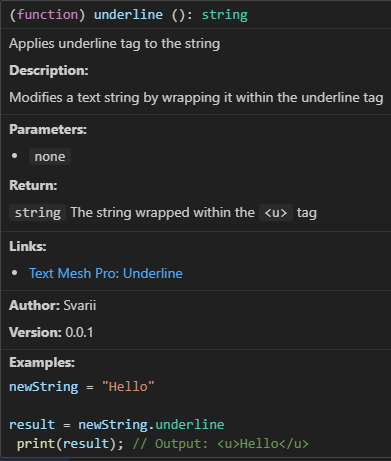

#### .uppercase
##### *[uppercase-tmpdocs](https://docs.unity3d.com/Packages/com.unity.textmeshpro@4.0/manual/RichTextLetterCase.html)*
The `.uppercase` method allows you to apply uppercase to the given text.

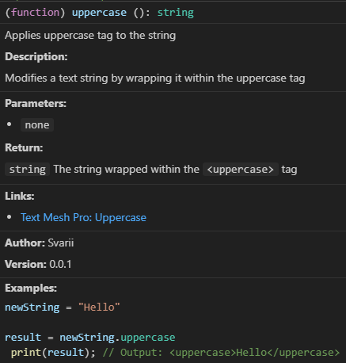

#### .voffset
##### *[voffset-tmpdocs](https://docs.unity3d.com/Packages/com.unity.textmeshpro@4.0/manual/RichTextVOffset.html)*
The `.voffset` method allows you to apply voffset to the given text.

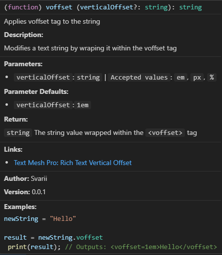


#### .width
##### *[width-tmpdocs](https://docs.unity3d.com/Packages/com.unity.textmeshpro@4.0/manual/RichTextWidth.html)*
The `.width` method allows you to apply width to the given text.

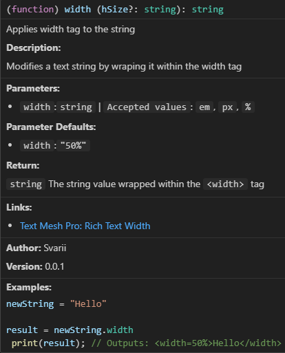


```
newString = "Hello"

print(newString.underline) // Outputs: <u>Hello</u>
```
### Map Methods
#### .get_attributes
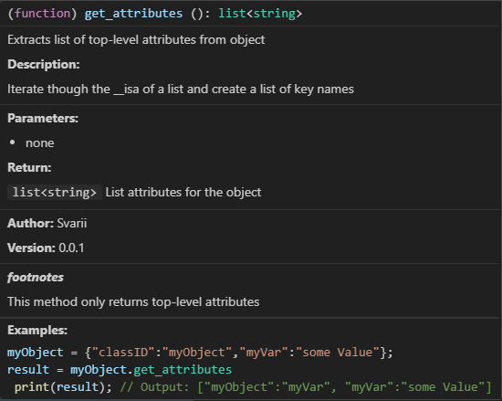

### Logic Methods
#### .extract
The `.extract` method allows you to extract the text between the provided values


```
newString = "<b>0x53C737</b>"

print(newString.extract_between("<b>", "</b>")) // Outputs: 0x53C737

```
#### .format
The `.format` method allows for string interpolation


```greyscript
// Modification of implimentation by dynobytes.
variableString = "The quick brown %s jumps over the lazy %s"
animalsList = ["fox", "dog"]      
sentence = variableString.format(animalsList)
print(sentence); // Outputs: The quick brown fox jumps over the lazy dog
```
### Removal Methods
#### .remove_char_last 
The `.remove_char_last` method allows you to remove the last character to the given text. Example usage:


```
newString = "Hello"

print(newString.remove_char_last) // Outputs: Hell
```


#### .remove_char_first
The `.remove_char_first` method allows you to remove the last character to the given text. Example usage:


```
newString = "Hello"

print(newString.remove_char_first) // Outputs: ello
```

#### .remove_bold
The `.remove_bold` method allows you to remove bold tags from the given text. Example usage:


```
newString = "<b>Hello</b>"

print(newString.remove_bold) // Outputs: Hello
```

#### .remove_italic
The `.remove_italic` method allows you to remove italic tags from the given text. Example usage:


```
newString = "<i>Hello</i>"

print(newString.remove_italic) // Outputs: Hello
```

#### .remove_underline
The `.remove_underline` method allows you to remove underline tags from the given text. Example usage:


```
newString = "<u>Hello</u>"

print(newString.remove_underline) // Outputs: Hello
```

#### .remove_strike
The `.remove_strike` method allows you to remove strikethrough tags from the given text. Example usage:


```
newString = "<s>Hello</s>"

print(newString.remove_strike) // Outputs: Hello
```

#### .remove_mark
The `.remove_mark` method allows you to remove mark tags from the given text. Example usage:


```
newString = "<mark>Hello</mark>"

print(newString.remove_mark) // Outputs: Hello
```

#### .remove_sub
The `.remove_sub` method allows you to remove sub tags from the given text. Example usage:


```
newString = "<sub>Hello</sub>"

print(newString.remove_sub) // Outputs: Hello
```

#### .remove_sup
The `.remove_sup` method allows you to remove superscript tags from the given text. Example usage:


```
newString = "<sup>Hello</sup>"

print(newString.remove_sup) // Outputs: Hello

```

## numberMethods


### .clamp
The `.clamp` method allows a number to be clamped within a specified range


### .diff
The `.diff` method calculates the absolute difference between the current number and another number.


```greyscript
newNumber = 44
newNumber2 = 2

result = newNumber.diff(newNumber2)
print(result) // Outputs: 42
```


### .divide
The `.divide` method divides the current number by another number.  Zero division will result in null


```greyscript
newNumber = 84
newNumber2 = 2

result = newNumber.divide(newNumber2)
print(result) // Outputs: 42
```

### .is_more
The `.is_more` method checks if the current number is greater than a provided number. Returns `true` if greater, `false` otherwise.


```greyscript
myNumber = 42
myNumber2 = 100

result = myNumber.greater_than(myNumber2)
print(result) // Outputs: 0 (false)
```

### .is_less
The `.is_less` method checks if the current number is less than a provided number. Returns `true` if lesser, `false` otherwise.


```greyscript
myNumber = 42
myNumber2 = 100

result = myNumber.lesser_than(myNumber2)
print(result) // Outputs: 1 (true)
```

### .lerp
The `.lerp` method computes the linear interpolation (lerp) between two numbers.


### .minus
The `.minus` method allows you to subtract a specified amount from a number. If no amount is provided, it defaults to `1`. 


```greyscript
newNumber = 44

result = newNumber.minus(2)
print(result) // Outputs: 42
```

### .multiply
The `.multiply` method multiplies the current number the given number (or 2).


```greyscript
newNumber = 21
newNumber2 = 2

result = newNumber.multiply(newNumber2)
print(result) // Outputs: 42
```

### .plus
The `.plus` method allows you to add a specified amount to a number. If no amount is provided, it defaults to `1`.


```greyscript
newNumber = 40

result = newNumber.plus(2)
print(result) // Outputs: 42
```

### .random_from
The `.random_from` method generates a random number in the range of 1 (or optional parameter) to number.


```greyscript
myNumber = 42
myNumber2 = 100

result = myNumber.lesser_than(myNumber2)
print(result) // Outputs: 1 (true)
```

### .saturate
The `.saturate` Clamps a number to the normalized range [0, 1].


---
## listMethods


---
### .crop
The `.crop` method Returns a new list stripped of any spacing at the beginning and ending. If any value gets passed that is not a list this method will return null.


```greyscript
myList = ["", "string", "string", "", ""]

result = myList.trim
print(result) // Outputs: ["string", "string"]
```

### .print
The `.print` method loops through a list and prints each item


```greyscript
myList = ["string", "string"]
myList.print

// Outputs:
string
string
```

---

## mapMethods
### .get_attributes


---
# 📄 Functions Overview
## bool_text

## fetch_whois

## file_new

## file_append

## file_delete
## file_exists
## force_params

## get_acks

## get_random_ip

## is_null

## is_type

## load_lib


```greyscript
lib = load_lib;
lib = load_lib("metaxploit.so");
lib = load_lib("metaxploit.so", "/lib");
lib = load_lib("metaxploit.so", "/lib", "MetatxploitLib");
// All Output: typeof(lib) == "MetaxploitLib"
```


## network_device_list

## program_name

## unsafe_check_list


# 📄 Construct Overview
## id_self

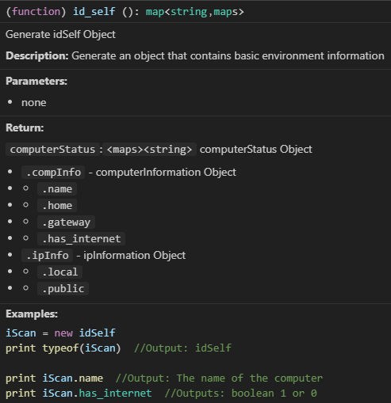


