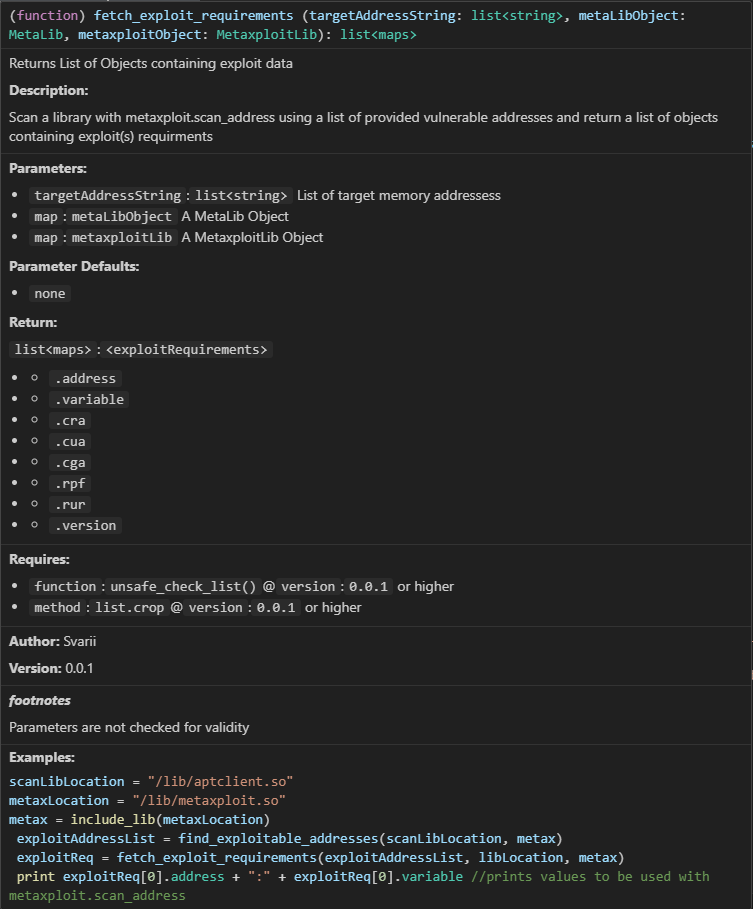

# ![GreyScript](https://img.shields.io/badge/GreyScript-Prime-black?labelColor=blue&style=for-the-badge&logo=&logoColor=white)

> # Table of Contents
> 
> <details>
> <summary>🅰️  Text Mesh Pro Methods</summary>
>
> - string.[align](#align)
> - string.[alpha](#alpha)
> - string.[bold](#bold)
> - string.[color](#color)
> - string.[cspace](#cspace)
> - string.[indent](#indent)
> - string.[italic](#italic)
> - string.[line-indent](#line-indent)
> - string.[lowercase](#lowercase)
> - string.[margin](#margin)
> - string.[mark](#mark)
> - string.[mspace](#mspace)
> - string.[nobr](#nobr)
> - string.[noparse](#noparse)
> - string.[page](#page)
> - string.[pos](#pos)
> - string.[remove_bold](#remove_bold)
> - string.[remove_char_first](#remove_char_first)
> - string.[remove_char_last](#remove_char_last)
> - string.[remove_italic](#remove_italic)
> - string.[remove_mark](#remove_mark)
> - string.[remove_strike](#remove_strike)
> - string.[remove_sub](#remove_sub)
> - string.[remove_sup](#remove_sup)
> - string.[remove_underline](#remove_underline)
> - string.[rotate](#rotate)
> - string.[size](#size)
> - string.[strike](#strike)
> - string.[sub](#sub)
> - string.[sup](#sup)
> - string.[underline](#underline)
> - string.[uppercase](#uppercase)
> - string.[voffset](#voffset)
> - string.[width](#width)
> </details>
>
> <details>
> <summary>🔢 Number Methods</summary>
>
> - number.[clamp](#clamp)
> - number.[diff](#diff)
> - number.[div](#div)
> - number.[is_float](#is_float)
> - number.[is_integer](#is_integer)
> - number.[is_more](#is_more)
> - number.[is_less](#is_less)
> - number.[lerp](#lerp)
> - number.[minus](#minus)
> - number.[multiply](#multiply)
> - number.[plus](#plus)
> - number.[random_from](#random_from)
> </details>
> <details>
> <summary>📋 List Methods</summary>
>
> - list.[crop](#crop)
> - list.[string](#string)
> </details>
>
> <details>
> <summary>🗂️ Map Methods</summary>
>
> - map.[get_attributes](#get_attributes)
> </details>
>
> <details>
> <summary>📁 File Management Functions</summary>
> 
> - [file_append](#file_append)
> - [file_delete](#file_delete)
> - [file_exists](#file_exists)
> - [file_location_ident](#file_location_ident)
> - [file_new](#file_new)
> </details>
>
> <details>
> <summary>⚙️ Task Functions</summary>
> 
> - [bool_text](#bool_text)
> - [extract_ip](#extract_ip)
> - [fetch_exploit_requirements](#fetch_exploit_requirements)
> - [fetch_whois](#fetch_whois)
> - [force_params](#force_params)
> - [get_acks](#get_acks)
> - [get_exploit_address_list](#get_exploit_address_list)
> - [get_inbox](#get_inbox)
> - [get_random_ip](#get_random_ip)
> - [is_null](#is_null)
> - [is_typeof](#is_typeof)
> - [load_lib](#load_lib)
> - [network_device_list](#network_device_list)
> - [parse_inbox](#parse_inbox)
> - [program_name](#program_name)
> - [report_string_construct__](#report_string_construct__)
> - [unsafe_check_list](#unsafe_check_list)
>

---

# 🅰️ 

## Logic

### remove_bold

#### 📝 Description  
Removes `<b>` and `</b>` tags from a string.

<details>
<summary>📃 About</summary>

- **Author:** Svarii  
- **Version:** 0.0.1  

</details>

#### ➖ Parameters  
| Parameter | Default Value |
|-----------|---------------|
| *(None)*  | *(None)*      |


#### 🔁 Return  
`string` — The input string without `<b>` and `</b>` tags.

#### 💡 Example

```greyscript
newString = "<b>Hello</b>"
result = newString.remove_bold
print(result)  // Output: Hello
```

---

### format

#### 📝 Description  
Allows for string interpolation by replacing a delimiter (`%s` by default) with values from a list.

<details>
<summary>📃 About</summary>

- **Author:** dynobytes
- **Contributor:** Svarii  
- **Version:** 0.0.1  

</details>

#### 🧮 Parameters

| Name     | Type         | Description                                  |
|----------|--------------|----------------------------------------------|
| `args`   | list<string> | List of values to insert into the string.    |
| `delim`  | string        | *(Optional)* Delimiter used in string. Default: `"%s"` |

##### ⚙️ Defaults

| Parameter | Default |
|-----------|---------|
| `args`   | _(None)_  |
| `delim`   | `"%s"`  |


#### 🔁 Return  
`string` — The formatted string with list values interpolated in place of the delimiter.

#### 💡 Example

```greyscript
variableString = "The quick brown %s jumps over the lazy %s"
animalsList = ["fox", "dog"]
sentence = variableString.format(animalsList)
print(sentence)  // Output: The quick brown fox jumps over the lazy dog
```

---

## Removal

### remove_bold

#### 📝 Description  
Removes `<b>` and `</b>` tags from a string.

<details>
<summary>📃 About</summary>

- **Author:** Svarii  
- **Version:** 0.0.1  

</details>

#### ➖ Parameters  
| Parameter | Default Value |
|-----------|---------------|
| *(None)*  | *(None)*      |

#### 🔁 Return  
`string` — The string without `<b>` and `</b>` tags.

#### 💡 Example

```greyscript
newString = "<b>Hello</b>"
result = newString.remove_bold
print(result)  // Output: Hello
```

---

### remove_char_first

#### 📝 Description  
Removes the first character of the given string.

<details>
<summary>📃 About</summary>

- **Author:** Svarii  
- **Version:** 0.0.1  

</details>


#### ➖ Parameters  
| Parameter | Default Value |
|-----------|---------------|
| *(None)*  | *(None)*      |

#### 🔁 Return  
`string` — The string with the first character removed.


#### 💡 Example
```greyscript
newString = "Hello"
result = newString.remove_char_first
print(result)  // Output: ello
```

---

### remove_char_last

#### 📝 Description  
Removes the last character of the given string.

<details>
<summary>📃 About</summary>

- **Author:** Svarii  
- **Version:** 0.0.1  

</details>

#### ➖ Parameters  
| Parameter | Default Value |
|-----------|---------------|
| *(None)*  | *(None)*      |

#### 🔁 Return  
`string` — The string with the last character removed.

#### 💡 Example
```greyscript
newString = "Hello"
result = newString.remove_char_last
print(result) // Outputs: Hell
```

---


### remove_italic

#### 📝 Description  
Removes `<i>` and `</i>` tags from a string.

<details>
<summary>📃 About</summary>

- **Author:** Svarii  
- **Version:** 0.0.1  

</details>

#### ➖ Parameters  
| Parameter | Default Value |
|-----------|---------------|
| *(None)*  | *(None)*      |

#### 🔁 Return  
`string` — The string without `<i>` and `</i>` tags.


#### 💡 Example
```greyscript
newString = "<i>Hello</i>"
result = newString.remove_italic
print(result) // Outputs: Hello
```

---

### remove_mark

#### 📝 Description  
Removes `<mark>` and `</mark>` tags from a string.

<details>
<summary>📃 About</summary>

- **Author:** Svarii  
- **Version:** 0.0.1  

</details>


#### ➖ Parameters  
| Parameter | Default Value |
|-----------|---------------|
| *(None)*  | *(None)*      |

#### 🔁 Return  
`string` — The string without `<mark>` and `</mark>` tags.


#### 💡 Example
```greyscript
newString = "<mark>Hello</mark>"
result = newString.remove_mark
print(result) // Outputs: Hello
```

---

### remove_strike

#### 📝 Description  
Removes `<s>` and `</s>` (strikethrough) tags from a string.

<details>
<summary>📃 About</summary>

- **Author:** Svarii  
- **Version:** 0.0.1  

</details>


#### ➖ Parameters  
| Parameter | Default Value |
|-----------|---------------|
| *(None)*  | *(None)*      |

#### 🔁 Return  
`string` — The string without `<s>` and `</s>` tags.


#### 💡 Example
```greyscript
newString = "<s>Hello</s>"
result = newString.remove_strike
print(result) // Outputs: Hello
```

---

### remove_sub

#### 📝 Description  
Removes `<sub>` and `</sub>` (subscript) tags from a string.

<details>
<summary>📃 About</summary>

- **Author:** Svarii  
- **Version:** 0.0.1  

</details>


#### ➖ Parameters  
| Parameter | Default Value |
|-----------|---------------|
| *(None)*  | *(None)*      |

#### 🔁 Return  
`string` — The string without `<sub>` and `</sub>` tags.


#### 💡 Example
```greyscript
newString = "<sub>Hello</sub>"
result = newString.remove_sub
print(result) // Outputs: Hello
```

---

### remove_sup

#### 📝 Description  
Removes `<sup>` and `</sup>` (superscript) tags from a string.

<details>
<summary>📃 About</summary>

- **Author:** Svarii  
- **Version:** 0.0.1  

</details>


#### ➖ Parameters  
| Parameter | Default Value |
|-----------|---------------|
| *(None)*  | *(None)*      |

#### 🔁 Return  
`string` — The string without `<sup>` and `</sup>` tags.


#### 💡 Example
```greyscript
newString = "<sup>Hello</sup>"
result = newString.remove_sup
print(result) // Outputs: Hello
```

---

### remove_underline

#### 📝 Description  
Removes `<u>` and `</u>` (underline) tags from a string.

<details>
<summary>📃 About</summary>

- **Author:** Svarii  
- **Version:** 0.0.1  

</details>


#### ➖ Parameters  
| Parameter | Default Value |
|-----------|---------------|
| *(None)*  | *(None)*      |

#### 🔁 Return  
`string` — The string without `<u>` and `</u>` tags.

#### 💡 Example
```greyscript
newString = "<u>Hello</u>"
result = newString.remove_underline
print(result) // Outputs: Hello
```

---

## align
### 📝 Description
Modifies a text string to wrap it in the `<align>` tag.
<details>
<summary>📃 About</summary>

- **Author:** Svarii  
- **Version:** 0.0.1 
- **Unit Testing:** ❌ Incomplete 

</details>


### 🧮 Parameters

| Name        | Type     | Description                                                                 |
|-------------|----------|-----------------------------------------------------------------------------|
| `alignment` | string   | Accepted values: `left`, `center`, `right`, `justified`, `flush`            |
| `closeTag`  | boolean  | Whether to close the tag with a matching `</align>`; accepted: `true/false` |

#### ⚙️ Defaults
| Parameter   | Default Value |
|-------------|----------------|
| `alignment` | `"center"`     |
| `closeTag`  | `true`         |

### 🔁 Return
`string` — the string value embedded in (or preceded by) the `<align>` tag.


### 💡 Examples
```greyscript
newString = "Hello"
    result = newString.align("center")
    print result 

// Output: <align="center">Hello</align>
```
```greyscript
newString = "Hello"
    result = newString.align("center", false)
    print result 

// Output: <align="center">Hello
```


#### 🔗 Links
* [Text Mesh Pro: Rich Text Alignment](https://docs.unity3d.com/Packages/com.unity.textmeshpro@4.0/manual/RichTextAlignment.html)

#### 🧠 Notes

- ⚠️ Parameters are **not validated**.
  - ⚠️ `alignment` will not reject invalid values → **Return**: `string<withParseIssues>`
  - ⚠️ `closeTag` will not reject invalid values → **Return**: `null`
- 🛈 If all parameters are invalid → **Return**: `null`
---

## alpha
### 📝 Description
Modifies a text string and prepends it with the `<alpha>` tag.
<details>
<summary>📃 About</summary>

- **Author:** Svarii  
- **Version:** 0.0.1 
- **Unit Testing:** ❌ Incomplete
</details>

### 🧮 Parameters

| Name         | Type   | Description                                                      |
|--------------|--------|------------------------------------------------------------------|
| `hexOpacity` | string | Accepted values: 2-digit HEX value preceded by `#` (e.g., `#4C`) |

#### ⚙️ Defaults
| Parameter    | Default Value |
|--------------|----------------|
| `hexOpacity` | `#FF`          |

### 🔁 Return
`string` — the string value preceded by the `<alpha>` tag.

### 💡 Example

```greyscript
newString = "Hello"
    result = newString.alpha("#4C")
    print(result)

  // Output: <alpha=#4C>Hello
```
```greyscript
newString = "Hello"
    result = newString.alpha
    print(result)

  // Output: <alpha=#FF>Hello
```
#### 🔗 Links
* [Text Mesh Pro: Rich Text Opacity](https://docs.unity3d.com/Packages/com.unity.textmeshpro@4.0/manual/RichTextOpacity.html)

#### 🧠 Notes

- ❌`hexOpacity` checked for type
- ❌`hexOpacity` checked for proper format
  - ⚠️`hexOpacity` will not reject invalid values → **Return**: `string<withParseIssues>`
- 🛈 This tag does **not** apply a closing tag; it affects **all text that follows**
- 🛈 If no parameter is passed, it applies default opacity `#FF` (fully opaque)

---

## bold
### 📝 Description
Modifies a text string and wraps it within the `<b>` tag.  
Used to apply bold styling in Text Mesh Pro.
<details>
<summary>📃 About</summary>

- **Author:** Svarii  
- **Version:** 0.0.1 
- **Unit Testing:** ❌ Incomplete
</details>

### ➖ Parameters  
| Parameter | Default Value |
|-----------|---------------|
| *(None)*  | *(None)*      |


### 🔁 Return
`string` — the string value embedded in the `<b>` tag.

### 💡 Example

```greyscript
newString = "Hello"

result = newString.bold
print(result)  // Output: <b>Hello</b>
```
#### 🔗 Links
* [Text Mesh Pro: Rich Text Bold](https://docs.unity3d.com/Packages/com.unity.textmeshpro@4.0/manual/RichTextBoldItalic.html)

---

## color

### 📝 Description
Modifies a text string by wrapping it within the `<color>` tag.  
Used to apply a specified color to the string, supporting both hex formats and standard HTML color names.
<details>
<summary>📃 About</summary>

- **Author:** Svarii  
- **Version:** 0.0.1 
- **Unit Testing:** ❌ Incomplete
</details>

### 🧮 Parameters

| Name         | Type   | Description                                                                 |
|--------------|--------|-----------------------------------------------------------------------------|
| `colorValue` | string | The desired color in hex format: `#RRGGBB`, `#RRGGBBAA`, or standard HTML color name (e.g., `"blue"`, `"Aquamarine"`) |

#### 🚫 Defaults

| Parameter | Default Value |
|-----------|---------------|
| *colorValue*  | *(None)*      |


### 🔁 Return
`string` — the string value embedded in the `<color>` tag.


### 💡 Example
```greyscript
newString = "Hello"

result = newString.color("blue")
print result  // Output: <color=blue>Hello</color>

result = newString.color("#FFFFFF")
print result  // Output: <color=#FFFFFF>Hello</color>

result = newString.color("Aquamarine")
print result  // Output: <color=#7FFFD4>Hello</color>
```


#### 🔗 Links
- [Text Mesh Pro: Rich Color Text](https://docs.unity3d.com/Packages/com.unity.textmeshpro@4.0/manual/RichTextColor.html)  
- [HTML Color Names: Supported Name List](https://htmlcolorcodes.com/color-names/)

#### 🧠 Notes
- Color names are case sensitive
- Blue and blue, green and Green, are different colors

---


## cspace

### 📝 Description
Modifies a text string by wrapping it within the `<cspace>` tag.  
Used to control character spacing in text renderers such as Text Mesh Pro.
<details>
<summary>📃 About</summary>

- **Author:** Svarii  
- **Version:** 0.0.1 
- **Unit Testing:** ❌ Incomplete
</details>

### 🧮 Parameters

| Name         | Type    | Description                                                                          |
|--------------|---------|--------------------------------------------------------------------------------------|
| `charSpacing`| string  | The amount of spacing to apply, e.g. `"1em"` or `"5px"`                             |
| `closeTag`   | boolean | Whether to close the tag with `</cspace>` — accepted values: `true` or `false`      |

#### ⚙️ Defaults
| Parameter    | Default Value |
|--------------|----------------|
| `charSpacing` | `1em`          |
| `closeTag` | `true`          |

### 🔁 Return
`string` — The string value wrapped within the `<cspace>` tag.


### 💡 Example
```greyscript
newString = "Hello"

result = newString.cspace
print result  // Output: <cspace=1em>Hello</cspace>
```

#### 🔗 Links
- [Text Mesh Pro: Rich Text Character Spacing](https://docs.unity3d.com/Packages/com.unity.textmeshpro@4.0/manual/RichTextCharacterSpacing.html)

#### 🧠 Notes
- Accepts pixel font unit  or percentage values (e.g., `px`, `em`, `%`)

---


## indent

### 📝 Description
Modifies a text string to wrap it in the `<indent>` tag for use with supported rich text renderers (e.g., Text Mesh Pro).
<details>
<summary>📃 About</summary>

- **Author:** Svarii  
- **Version:** 0.0.1 
- **Unit Testing:** ❌ Incomplete
</details>

### 🧮 Parameters

| Name           | Type     | Description                                                                 |
|----------------|----------|-----------------------------------------------------------------------------|
| `indentPercent` | string   | Optional. Accepted input: `em`, `px`, or `%` units.                         |
| `closeTag`     | boolean  | Optional. Whether to append a closing `</indent>` tag. Accepted: `true` or `false`. |

#### ⚙️ Defaults

| Parameter       | Default |
|-----------------|---------|
| `indentPercent` | `15%`   |
| `closeTag`      | `true`  |

### 🔁 Return
`string` — the string value embedded in (or appended to) the `<indent>` tag.


### 💡 Example
```greyscript
newString = "Hello"
    result = newString.indent
    print(result)

  // Output: <indent=15%>Hello</indent>
```
```greyscript
newString = "Hello"
    result = newString.indent("3em")
    print(result)

  // Output: <indent=3em>Hello</indent>
```
```greyscript
newString = "Hello"
    result = newString.indent("25px", false)
    print(result)

  // Output: <indent=25px>Hello
```
#### 🔗 Links
- [Text Mesh Pro: Rich Text Indentation](https://docs.unity3d.com/Packages/com.unity.textmeshpro@4.0/manual/RichTextIndentation.html)

#### 🧠 Notes
- Parameters are not checked for validity.
- `indentPercent` will not reject invalid values → **Return:** `string<withParseIssues>`
- `closeTag` will not reject invalid values → **Return:** `null`
- If all parameters are invalid → **Return:** `null`

---

## italic

### 📝 Description
Modifies a text string by wrapping it within the `<i>` tag.
<details>
<summary>📃 About</summary>

- **Author:** Svarii  
- **Version:** 0.0.1 
- **Unit Testing:** ❌ Incomplete
</details>

### ➖ Parameters  
| Parameter | Default Value |
|-----------|---------------|
| *(None)*  | *(None)*      |

### 🔁 Return
`string` — The string value wrapped within the `<i>` tag.

### 💡 Example

```greyscript
newString = "Hello"

result = newString.italic
print(result)  // Output: <i>Hello</i>
```
#### 🔗 Links
- [Text Mesh Pro: Rich Text Indentation](https://docs.unity3d.com/Packages/com.unity.textmeshpro@4.0/manual/RichTextIndentation.html)
---


## line-indent

### 📝 Description
Modifies a text string to wrap it in the `<line-indent>` tag.
<details>
<summary>📃 About</summary>

- **Author:** Svarii  
- **Version:** 0.0.1 
- **Unit Testing:** ❌ Incomplete
</details>

### 🧮 Parameters

| Name           | Type     | Description                                           |
|----------------|----------|-----------------------------------------------------|
| `indentPercent` | string   | Optional. Accepted input: `em`, `px`, or `%`       |
| `closeTag`     | boolean  | Optional. Whether to append a closing `</line-indent>` tag. Accepted: `true` or `false`. |

#### ⚙️ Defaults

| Parameter       | Default |
|-----------------|---------|
| `indentPercent` | `15%`   |
| `closeTag`      | `true`  |

### 🔁 Return
`string` — The string value embedded in (or appended to) the `<line-indent>` tag.

### 💡 Example

```greyscript
newString = "Hello"
    result = newString.line-indent
    print(result)

  // Output: <line-indent=15%>Hello</line-indent>
```
```greyscript
newString = "Hello"
    result = newString.line-indent("3em")
    print(result)

  // Output: <line-indent=3em>Hello</line-indent>
```
```greyscript
newString = "Hello"
    result = newString.line-indent("25px", false)
    print(result)

  // Output: <line-indent=25px>Hello
```
---

## lowercase

### 📝 Description
Modifies a text string by wrapping it within the `<lowercase>` tag.
<details>
<summary>📃 About</summary>

- **Author:** Svarii  
- **Version:** 0.0.1 
- **Unit Testing:** ❌ Incomplete
</details>

### ➖ Parameters  
| Parameter | Default Value |
|-----------|---------------|
| *(None)*  | *(None)*      |


### 🔁 Return
`string` — The string value wrapped within the `<lowercase>` tag.

### 💡 Example

```greyscript
newString = "Hello"

result = newString.lowercase
print(result)  // Output: <lowercase>Hello</lowercase>
```

#### 🔗 Links
- [Text Mesh Pro: Rich Text Lowercase](https://docs.unity3d.com/Packages/com.unity.textmeshpro@4.0/manual/RichTextLetterCase.html)

---


## margin

### 📝 Description
Modifies a text string by wrapping it within the `<margin>` tag.
<details>
<summary>📃 About</summary>

- **Author:** Svarii  
- **Version:** 0.0.1 
- **Unit Testing:** ❌ Incomplete
</details>

### 🧮 Parameters

| Name     | Type   | Description                                      |
|----------|--------|--------------------------------------------------|
| `margin` | string | Optional. Accepted values: `em`, `px`, or `%`.   |


#### ⚙️ Defaults

| Parameter | Default |
|-----------|---------|
| `margin`  | `5em`   |


### 🔁 Return
`string` — The string value wrapped within the `<margin>` tag.

### 💡 Example

```greyscript
newString = "Hello"

result = newString.margin
print(result)  // Output: <margin=5em>Hello</margin>
```


#### 🔗 Links
- [Text Mesh Pro: Rich Text Margin](https://docs.unity3d.com/Packages/com.unity.textmeshpro@4.0/manual/RichTextMargins.html)

---

## mark
### 📝 Description
Modifies a text string by wrapping it within the `<mark>` tag.
<details>
<summary>📃 About</summary>

- **Author:** Svarii  
- **Version:** 0.0.1 
- **Unit Testing:** ❌ Incomplete
</details>

### 🧮 Parameters

| Name    | Type   | Description                                 |
|---------|--------|---------------------------------------------|
| `color` | string | Optional. HEXA color value (`#RRGGBBAA`).   |


#### ⚙️ Defaults

| Parameter | Default     |
|-----------|-------------|
| `color`   | `#FFFF00AA` |


### 🔁 Return
`string` — The string value wrapped within the `<mark>` tag.

### 💡 Example

```greyscript
newString = "Hello"

result = newString.mark
print(result)  // Output: <mark="#FFFF00AA">Hello</mark>
```


#### 🔗 Links
- [Text Mesh Pro: Rich Text mark](https://docs.unity3d.com/Packages/com.unity.textmeshpro@4.0/manual/RichTextMark.html)

---

## mspace

### 📝 Description
Modifies a text string by wrapping it within the `<mspace>` tag.
<details>
<summary>📃 About</summary>

- **Author:** Svarii  
- **Version:** 0.0.1 
- **Unit Testing:** ❌ Incomplete 

</details>

### 🧮 Parameters

| Name        | Type   | Description                                     |
|-------------|--------|-------------------------------------------------|
| `monospace` | string | Optional. Accepted values: `em`, `px`, or `%`. |


#### ⚙️ Defaults

| Parameter   | Default   |
|-------------|-----------|
| `monospace` | `2.75em`  |


### 🔁 Return
`string` — The string value wrapped within the `<mspace>` tag.

### 💡 Example

```greyscript
newString = "Hello"

result = newString.mspace
print(result)  // Output: <mspace="2.75em">Hello</mspace>
```

#### 🔗 Links
- [Text Mesh Pro: Rich Text Monospacing](https://docs.unity3d.com/Packages/com.unity.textmeshpro@4.0/manual/RichTextMonospace.html)

---

## nobr

### 📝 Description
Modifies a text string by wrapping it within the `<nobr>` tag.
<details>
<summary>📃 About</summary>

- **Author:** Svarii  
- **Version:** 0.0.1 
- **Unit Testing:** ❌ Incomplete 

</details>

### ➖ Parameters  
| Parameter | Default Value |
|-----------|---------------|
| *(None)*  | *(None)*      |


### 🔁 Return
`string` — The string value wrapped within the `<nobr>` tag.

### 💡 Example

```greyscript
newString = "Hello"

result = newString.nobr
print(result)  // Output: <nobr>Hello</nobr>
```

#### 🔗 Links
- [Text Mesh Pro: Rich Text No Break](https://docs.unity3d.com/Packages/com.unity.textmeshpro@4.0/manual/RichTextNoBreak.html)

---

## noparse

### 📝 Description
Modifies a text string by wrapping it within the `<noparse>` tag.
<details>
<summary>📃 About</summary>

- **Author:** Svarii  
- **Version:** 0.0.1 
- **Unit Testing:** ❌ Incomplete 

</details>

### ➖ Parameters  
| Parameter | Default Value |
|-----------|---------------|
| *(None)*  | *(None)*      |


### 🔁 Return
`string` — The string value wrapped within the `<noparse>` tag.

### 💡 Example

```greyscript
newString = "Hello"

result = newString.noparse
print(result)  // Output: <noparse>Hello</noparse>
```


#### 🔗 Links
- [Text Mesh Pro: Rich Text Noparse](https://docs.unity3d.com/Packages/com.unity.textmeshpro@4.0/manual/RichTextNoParse.html)

---

## page

### 📝 Description
Modifies a text string by appending the `<page>` tag to the end.
<details>
<summary>📃 About</summary>

- **Author:** Svarii  
- **Version:** 0.0.1 
- **Unit Testing:** ❌ Incomplete 

</details>

### ➖ Parameters  
| Parameter | Default Value |
|-----------|---------------|
| *(None)*  | *(None)*      |


### 🔁 Return
`string` — The string value with the `<page>` tag appended to the end.

### 💡 Example

```greyscript
newString = "Hello"

result = newString.page
print(result)  // Output: Hello<page>
```

#### 🔗 Links
- [Text Mesh Pro: Page Break](https://docs.unity3d.com/Packages/com.unity.textmeshpro@4.0/manual/RichTextPageBreak.html)

---

## pos

### 📝 Description
Modifies a text string by prepending it with the `<pos>` tag.
<details>
<summary>📃 About</summary>

- **Author:** Svarii  
- **Version:** 0.0.1 
- **Unit Testing:** ❌ Incomplete 

</details>

### 🧮 Parameters

| Name      | Type   | Description            |
|-----------|--------|------------------------|
| `position` | string | Optional. Default: `"50%"` |


#### ⚙️ Defaults

| Parameter  | Default |
|------------|---------|
| `position` | `"50%"` |


### 🔁 Return
`string` — The string prepended with the `<pos>` tag.


### 💡 Example

```greyscript
newString = "Hello"

result = newString.pos
print(result)  // Output: <pos=50%>Hello
```

#### 🔗 Links
- [Text Mesh Pro: Horizontal Position](https://docs.unity3d.com/Packages/com.unity.textmeshpro@4.0/manual/RichTextPos.html)

---

## rotate

### 📝 Description
Modifies a text string by wrapping it within the `<rotate>` tag.
<details>
<summary>📃 About</summary>

- **Author:** Svarii  
- **Version:** 0.0.1 
- **Unit Testing:** ❌ Incomplete 

</details>

### 🧮 Parameters

| Name             | Type   | Description            |
|------------------|--------|------------------------|
| `degreesRotation` | string | Optional. Default: `"45"` |


#### ⚙️ Defaults

| Parameter         | Default |
|-------------------|---------|
| `degreesRotation` | `"45"`  |


### 🔁 Return
`string` — The string rotated with the `<rotate>` tag.

### 💡 Example

```greyscript
newString = "Hello"

result = newString.rotate
print(result)  // Output: <rotate="45">Hello </rotate>
```


#### 🔗 Links
- [Text Mesh Pro: Rotate](https://docs.unity3d.com/Packages/com.unity.textmeshpro@4.0/manual/RichTextRotate.html)

---

## size

### 📝 Description
Modifies a text string by wrapping it within the `<size>` tag.
<details>
<summary>📃 About</summary>

- **Author:** Svarii  
- **Version:** 0.0.1 
- **Unit Testing:** ❌ Incomplete 

</details>

### 🧮 Parameters

| Name      | Type   | Description          |
|-----------|--------|----------------------|
| `textSize`| string | Optional. Default: `"5em"` |


#### ⚙️ Defaults

| Parameter  | Default |
|------------|---------|
| `textSize` | `"5em"` |


### 🔁 Return
`string` — The string wrapped within the `<size>` tag.

### 💡 Example

```greyscript
newString = "Hello"

result = newString.size
print(result)  // Output: <size="5em">Hello </size>
```

#### 🔗 Links
- [Text Mesh Pro: Font Size](https://docs.unity3d.com/Packages/com.unity.textmeshpro@4.0/manual/RichTextSize.html)

---

## strike

### 📝 Description
Modifies a text string by wrapping it within the `<s>` tag.
<details>
<summary>📃 About</summary>

- **Author:** Svarii  
- **Version:** 0.0.1 
- **Unit Testing:** ❌ Incomplete 

</details>

### ➖ Parameters  
| Parameter | Default Value |
|-----------|---------------|
| *(None)*  | *(None)*      |


### 🔁 Return
`string` — The string wrapped within the `<s>` tag.

### 💡 Example

```greyscript
newString = "Hello"

result = newString.strike
print(result)  // Output: <s>Hello</s>
```

#### 🔗 Links
- [Text Mesh Pro: Strikethrough](https://docs.unity3d.com/Packages/com.unity.textmeshpro@4.0/manual/RichTextStrikethroughUnderline.html)

---

## sub

### 📝 Description
Modifies a text string by wrapping it within the `<sub>` tag.
<details>
<summary>📃 About</summary>

- **Author:** Svarii  
- **Version:** 0.0.1 
- **Unit Testing:** ❌ Incomplete 

</details>

### ➖ Parameters  
| Parameter | Default Value |
|-----------|---------------|
| *(None)*  | *(None)*      |


### 🔁 Return
`string` — The string wrapped within the `<sub>` tag.

### 💡 Example

```greyscript
newString = "Hello"

result = newString.sub
print(result)  // Output: <sub>Hello</sub>
```

#### 🔗 Links
- [Text Mesh Pro: Subscript](https://docs.unity3d.com/Packages/com.unity.textmeshpro@4.0/manual/RichTextSubSuper.html)

---

## sup

### 📝 Description
Modifies a text string by wrapping it within the `<sup>` tag.
<details>
<summary>📃 About</summary>

- **Author:** Svarii  
- **Version:** 0.0.1 
- **Unit Testing:** ❌ Incomplete 

</details>

### ➖ Parameters  
| Parameter | Default Value |
|-----------|---------------|
| *(None)*  | *(None)*      |

### 🔁 Return
`string` — The string wrapped within the `<sup>` tag.

### 💡 Example

```greyscript
newString = "Hello"

result = newString.sup
print(result)  // Output: <sup>Hello</sup>
```

#### 🔗 Links
- [Text Mesh Pro: Superscript](https://docs.unity3d.com/Packages/com.unity.textmeshpro@4.0/manual/RichTextSubSuper.html)

---

## underline

### 📝 Description
Modifies a text string by wrapping it within the `<u>` tag.
<details>
<summary>📃 About</summary>

- **Author:** Svarii  
- **Version:** 0.0.1 
- **Unit Testing:** ❌ Incomplete 

</details>

### ➖ Parameters  
| Parameter | Default Value |
|-----------|---------------|
| *(None)*  | *(None)*      |

### 🔁 Return
`string` — The string wrapped within the `<u>` tag.

### 💡 Example

```greyscript
newString = "Hello"

result = newString.underline
print(result)  // Output: <u>Hello</u>
```

#### 🔗 Links
- [Text Mesh Pro: Underline](https://docs.unity3d.com/Packages/com.unity.textmeshpro@4.0/manual/RichTextStrikethroughUnderline.html)

---

## uppercase

### 📝 Description
Modifies a text string by wrapping it within the `<uppercase>` tag.
<details>
<summary>📃 About</summary>

- **Author:** Svarii  
- **Version:** 0.0.1 
- **Unit Testing:** ❌ Incomplete 

</details>

### ➖ Parameters  
| Parameter | Default Value |
|-----------|---------------|
| *(None)*  | *(None)*      |


### 🔁 Return
`string` — The string wrapped within the `<uppercase>` tag.

### 💡 Example

```greyscript
newString = "Hello"

result = newString.uppercase
print(result)  // Output: <uppercase>Hello</uppercase>
```

#### 🔗 Links
- [Text Mesh Pro: Uppercase](https://docs.unity3d.com/Packages/com.unity.textmeshpro@4.0/manual/RichTextLetterCase.html)

---

## voffset

### 📝 Description  
Modifies a text string by wrapping it within the `<voffset>` tag.
<details>
<summary>📃 About</summary>

- **Author:** Svarii  
- **Version:** 0.0.1 
- **Unit Testing:** ❌ Incomplete 

</details>

### 🧮 Parameters

| Name           | Type     | Description                          |
|----------------|----------|------------------------------------|
| `verticalOffset` | string   | Optional. Accepted input: `em`, `px`, or `%` |


#### ⚙️ Defaults

| Parameter       | Default |
|-----------------|---------|
| `verticalOffset` | `1em`   |


### 🔁 Return  
`string` — The string value wrapped within the `<voffset>` tag.

### 💡 Example

```greyscript
newString = "Hello"

result = newString.voffset
print(result)  // Output: <voffset=1em>Hello</voffset>
```

#### 🔗 Links
- [Text Mesh Pro: Vertical Offset](https://docs.unity3d.com/Packages/com.unity.textmeshpro@4.0/manual/RichTextVOffset.html)

---

## width

### 📝 Description  
Modifies a text string by wrapping it within the `<width>` tag.
<details>
<summary>📃 About</summary>

- **Author:** Svarii  
- **Version:** 0.0.1 
- **Unit Testing:** ❌ Incomplete 

</details>

### 🧮 Parameters

| Name    | Type   | Description                         |
|---------|--------|-----------------------------------|
| `width` | string | Optional. Accepted input: `em`, `px`, or `%`. |


#### ⚙️ Defaults

| Parameter | Default |
|-----------|---------|
| `width`   | `"50%"` |


### 🔁 Return  
`string` — The string value wrapped within the `<width>` tag.

### 💡 Example

```greyscript
newString = "Hello"

result = newString.width
print(result)  // Output: <width=50%>Hello</width>
```


#### 🔗 Links
- [Text Mesh Pro: Horizontal Position](https://docs.unity3d.com/Packages/com.unity.textmeshpro@4.0/manual/RichTextPos.html)

---

# 🔢 

## clamp

### 📝 Description  
Ensure a number stays between a minimum and maximum value.

<details>
<summary>📃 About</summary>

- **Author:** Svarii  
- **Version:** 0.0.1  

</details>

### 🧮 Parameters

| Name | Type   | Description          |
|------|--------|----------------------|
| `min`| number | The min threshold.   |
| `max`| number | The max threshold.   |

#### ⚙️ Defaults

| Parameter | Default Value |
|-----------|---------------|
| *(None)*  | *(None)*      |


### 🔁 Return  
`number` — Clamped number between the min and max bounds.

### 💡 Example

```greyscript
myNumber = 42
print myNumber.clamp(42, 100)  // Output: 42
print myNumber.clamp(75, 100)  // Output: 75
print myNumber.clamp(0, 40)    // Output: 40
```

#### 🧠 Notes  
- Ensures `self` is within `[min, max]`.  
- Returns `min` if `self` is below the range, `max` if above.  
- Useful for keeping values bounded within a range.

---


## diff

### 📝 Description  
The difference between number and provided number.

<details>
<summary>📃 About</summary>

- **Author:** Svarii  
- **Version:** 0.0.1  

</details>

### 🧮 Parameters

| Name         | Type   | Description                 |
|--------------|--------|-----------------------------|
| `distanceTo` | number | Optional. Default: `0`      |

#### ⚙️ Defaults

| Parameter    | Default |
|--------------|---------|
| `distanceTo` | `0`     |

### 🔁 Return  
`number` — The difference between the numbers.

### 💡 Example

```greyscript
myNumber = 42
print myNumber.diff(42, 100)  // Output: 57
print myNumber.diff(75, 100)  // Output: 25
print myNumber.diff(0, 40)    // Output: 40
```

#### 🧠 Notes  
- Uses absolute difference: `abs(self - distanceTo)`.  
- Defaults to comparing against 0 if no parameter is provided.

---

## div

### 📝 Description  
Divide 2 from the number or optional amount.

<details>
<summary>📃 About</summary>

- **Author:** Svarii  
- **Version:** 0.0.1  

</details>

### 🧮 Parameters

| Name     | Type   | Description                    |
|----------|--------|-------------------------------|
| `amount` | number | Optional. The amount to div by |

#### ⚙️ Defaults

| Parameter | Default |
|-----------|---------|
| `amount`  | `2`     |


### 🔁 Return  
`number` — The result of the division.

### 💡 Example

```greyscript
myNumber = 42
print myNumber.div      // Output: 21
print myNumber.div(21)  // Output: 2
print myNumber.div(0)   // Output: 0
```

#### 🧠 Notes  
- Returns `0` if the divisor (`amount`) is `0` to avoid division by zero error.

---

## is_float

### 📝 Description  
Checks if the number is a floating-point number (contains a decimal point).

<details>
<summary>📃 About</summary>

- **Author:** Svarii  
- **Version:** 0.0.1  

</details>

### ➖ Parameters  
| Parameter | Default Value |
|-----------|---------------|
| *(None)*  | *(None)*      |

### 🔁 Return  
`boolean` — Returns `true` if the number contains a decimal point, otherwise `false`.

### 💡 Example

```greyscript
print (42).is_float()    // false
print (3.14).is_float()  // true
```
---

## is_integer

### 📝 Description  
Checks if the number is an integer.

<details>
<summary>📃 About</summary>

- **Author:** Svarii  
- **Version:** 0.0.1  

</details>

### ➖ Parameters  
| Parameter | Default Value |
|-----------|---------------|
| *(None)*  | *(None)*      |

### 🔁 Return  
`boolean` — Returns `true` if the number is an integer, otherwise `false`.

### 💡 Example

```greyscript
print (420).is_integer()    // true
print (1.618).is_integer()  // false
```

---

## is_less

### 📝 Description  
Returns `true` if the number is less than the provided amount, otherwise `false`.

<details>
<summary>📃 About</summary>

- **Author:** Svarii  
- **Version:** 0.0.1  

</details>

### ➖ Parameters  
| Parameter | Default Value |
|-----------|---------------|
| *(None)*  | *(None)*      |

### 🔁 Return  
`boolean` — Returns `true` if the number is less than the provided amount, otherwise `false`.

### 💡 Example

```greyscript
myNumber = 42
myNumber2 = 100

result = myNumber.is_less(myNumber2)
print(result)  // Output: true
```
---

## is_more

### 📝 Description  
Returns `true` if the number is greater than the provided amount, otherwise `false`.

<details>
<summary>📃 About</summary>

- **Author:** Svarii  
- **Version:** 0.0.1  

</details>


### ➖ Parameters  
| Parameter | Default Value |
|-----------|---------------|
| *(None)*  | *(None)*      |

### 🔁 Return  
`boolean` — Returns `true` if the number is greater than the provided amount, otherwise `false`.

### 💡 Example

```greyscript
myNumber = 42
myNumber2 = 100

result = myNumber.is_more(myNumber2)
print(result)  // Output: false
```
---

## is_zero

### 📝 Description  
Checks if the number is zero.

<details>
<summary>📃 About</summary>

- **Author:** Svarii  
- **Version:** 0.0.1  

</details>

### ➖ Parameters  
| Parameter | Default Value |
|-----------|---------------|
| *(None)*  | *(None)*      |

### 🔁 Return  
`boolean` — Returns `true` if the number is zero, otherwise `false`.


### 💡 Example
```greyscript
myNumber = 0
result = myNumber.is_zero
print(result)  // Outputs: true
```

---


## is_positive

### 📝 Description  
Checks if the number is positive (including zero).

<details>
<summary>📃 About</summary>

- **Author:** Svarii  
- **Version:** 0.0.1  

</details>
---

### ➖ Parameters  
| Parameter | Default Value |
|-----------|---------------|
| *(None)*  | *(None)*      |

### 🔁 Return  
`boolean` — Returns `true` if the number is greater than or equal to zero, otherwise `false`.

---

### 💡 Example
```greyscript
num = 10
result = num.is_positive
print(result)  // true

num2 = -5
result2 = num2.is_positive
print(result2) // false
```

---

## is_negative

### 📝 Description  
Checks if the number is negative.

<details>
<summary>📃 About</summary>

- **Author:** Svarii  
- **Version:** 0.0.1  

</details>
---

### ➖ Parameters  
| Parameter | Default Value |
|-----------|---------------|
| *(None)*  | *(None)*      |

### 🔁 Return  
`boolean` — Returns `true` if the number is less than zero, otherwise `false`.

---

### 💡 Example
```greyscript
num = -10
result = num.is_negative
print(result)  // true

num2 = 5
result2 = num2.is_negative
print(result2) // false
```

---


## lerp

### 📝 Description  
Performs linear interpolation between `min` and `max` using `offset`.

<details>
<summary>📃 About</summary>

- **Author:** Svarii  
- **Version:** 0.0.1  

</details>

### 🧮 Parameters

| Name      | Type   | Description                                        |
|-----------|--------|----------------------------------------------------|
| `min`     | number | The starting value.                                |
| `max`     | number | The ending value.                                  |
| `offset`  | number | A number between `0` and `1` representing progress |

### 🔁 Return  
`number` — A value between `min` and `max`, interpolated by `offset`.

### 💡 Example

```greyscript
print number.lerp(0, 100, 0.5)   // Output: 50
print number.lerp(10, 20, 0.25)  // Output: 12.5
print number.lerp(100, 200, 1.5) // Output: 200 (clamped)
```
---


## minus

### 📝 Description  
Subtracts `1` from the number or a specified amount.

<details>
<summary>📃 About</summary>

- **Author:** Svarii  
- **Version:** 0.0.1  

</details>

### 🧮 Parameters

| Name     | Type   | Description                   |
|----------|--------|-------------------------------|
| `amount` | number | Optional. The amount to subtract |

#### ⚙️ Defaults

| Parameter | Default |
|-----------|---------|
| `amount`  | `1`     |

### 🔁 Return  
`number` — The result of the subtraction.

### 💡 Example

```greyscript
newNumber = 44

result = newNumber.minus(2)
print(result)  // Output: 42
```
---

## multiply

### 📝 Description  
Multiplies the number by 2 or a specified amount.

<details>
<summary>📃 About</summary>

- **Author:** Svarii  
- **Version:** 0.0.1  

</details>

### 🧮 Parameters

| Name     | Type   | Description                      |
|----------|--------|----------------------------------|
| `amount` | number | Optional. The amount to multiply by |

#### ⚙️ Defaults

| Parameter | Default |
|-----------|---------|
| `amount`  | `2`     |

### 🔁 Return  
`number` — The result of the multiplication.

### 💡 Example

```greyscript
newNumber = 21

result = newNumber.multiply
print(result)  // Output: 42

result2 = newNumber.multiply(3)
print(result2)  // Output: 63
```
---

## plus

### 📝 Description  
Add 1 to the number or optional amount.

<details>
<summary>📃 About</summary>

- **Author:** Svarii  
- **Version:** 0.0.1  

</details>

### 🧮 Parameters

| Name     | Type   | Description                 |
|----------|--------|-----------------------------|
| `amount` | number | Optional. The amount to add |

#### ⚙️ Defaults

| Parameter | Default |
|-----------|---------|
| `amount`  | `1`     |


### 🔁 Return  
`number` — The result of the addition.

### 💡 Example

```greyscript
newNumber = 40
result = newNumber.plus(2)
print(result)  // Output: 42
```

---

## random_from

### 📝 Description  
Generate a random number from 0 to number, or from optional minimum to number.

<details>
<summary>📃 About</summary>

- **Author:** Svarii  
- **Version:** 0.0.1  

</details>

### 🧮 Parameters

| Name  | Type   | Description                      |
|-------|--------|---------------------------------|
| `min` | number | Optional. The minimum value for the random range |

#### ⚙️ Defaults

| Parameter | Default |
|-----------|---------|
| `min`     | `0`     |


### 🔁 Return  
`number` — A random number between `min` and the number itself.

### 💡 Example

```greyscript
myNumber = 100
result = myNumber.random_from(50)
print(result)  // Output: A random number between 50 and 100
```

---

# 📋 


## crop

### 📝 Description  
Iterates through a list from both ends and removes empty items, returning the cleaned list.

<details>
<summary>📃 About</summary>

- **Author:** Svarii  
- **Version:** 0.0.1  

</details>

### ➖ Parameters  
| Parameter | Default Value |
|-----------|---------------|
| *(None)*  | *(None)*      |

### 🔁 Return  
`list` — The same list with empty items purged from the start and end.

### 💡 Example

```greyscript
myList = ["","","cat","dog",""]
result = myList.crop
print(result)  // Output: ["cat","dog"]
```

---


## string

### 📝 Description  
Iterates through a list and constructs a string by joining all elements using the provided separator, or `char(10)` by default.

<details>
<summary>📃 About</summary>

- **Author:** Svarii  
- **Version:** 0.0.1  

</details>

### 🧮 Parameters

| Name       | Type   | Description                                                        |
|------------|--------|--------------------------------------------------------------------|
| `separator`| string | Optional. The character(s) to use to separate the list items. Default is `char(10)` |

#### ⚙️ Defaults

| Parameter   | Default  |
|-------------|----------|
| `separator` | `char(10)` |

### 🔁 Return  
`string` — The newly constructed string joining all list elements.

### 💡 Example

```greyscript
myList = ["cat", "dog"]
print myList.string()       // Outputs: "cat" + char(10) + "dog"
print myList.string(", ")   // Outputs: "cat, dog"
```

---

# 🗂️ 


## get_attributes

### 📝 Description  
Iterates through the `__isa` property of an object and returns a list of top-level attribute names.

<details>
<summary>📃 About</summary>

- **Author:** Svarii  
- **Version:** 0.0.1  

</details>

### ➖ Parameters  
| Parameter | Default Value |
|-----------|---------------|
| *(None)*  | *(None)*      |

### 🔁 Return  
`list<string>` — List of top-level attribute names.


### 💡 Example

```greyscript
myObject = {"classID":"myObject", "myVar":"some Value"}
result = myObject.get_attributes()
print(result)  // Output: ["classID", "myVar"]
```
#### 🧠 Notes  
- Only top-level attributes are returned.

---

# ⚙️ 


## bool_text

### 📝 Description  
Converts a boolean-like value (`true`, `false`, `1`, `0`) into a string: `"true"` or `"false"`.
<details>
<summary>📃 About</summary>

- **Author:** Svarii  
- **Version:** 0.0.1 
- **Unit Testing:** ❌ Incomplete 

</details>

### 🧮 Parameters

| Name      | Type   | Description       |
|-----------|--------|-------------------|
| `boolVal` | flag   | A boolean or number (0 or 1) to be converted to a string. |

#### 🚫 Defaults
| Parameter | Default Value |
|-----------|---------------|
| *boolVal*  | *(None)*  |

### 🔁 Return  
`string` — Returns `"true"` or `"false"` if the value is valid. Returns `null` for invalid input.


### 💡 Examples
```greyscript
print(bool_text("true"))  // Output: null
```
```greyscript
print(bool_text(true))  // Output: "true"
```
```greyscript
print(bool_text(1))  // Output: "true"
```
```greyscript
print(bool_text(0))  // Output: "false"
```
```greyscript
print(bool_text(-1))  // Output: "false"
```
```greyscript
print(bool_text(false))  // Output: "false"
```
```greyscript
print(bool_text(object))  // Output: null
```
#### 🧠 Notes

- Parameters are not checked for validity.
- Invalid input (including strings or objects) returns `null`.
- Negative numbers return `"false"`.

---

## extract_ip

### 📝 Description  
Scans a string for a valid IPv4 address and returns the first match.  

<details>
<summary>📃 About</summary>

- **Author:** Svarii  
- **Version:** 0.0.1  

</details>

### 🧮 Parameters

| Name          | Type   | Description                                    |
|---------------|--------|------------------------------------------------|
| `inputString` | string | The text string to search for an IP address.   |


#### 🚫 Defaults
| Parameter | Default Value |
|-----------|---------------|
| *inputString*  | *(None)*  |


### 🔁 Return  
`string | null` — The first matching IPv4 address, or `null` if none is found.

### 💡 Example

```greyscript
print(extractIP("My IP is 192.168.1.5"))  // Output: 192.168.1.5
```

```greyscript
print(extractIP("No IP here"))  // Output: null
```

```greyscript
print(extractIP("IPs: 10.0.0.1, 172.16.0.1"))  // Output: 10.0.0.1
```

---

## file_append

### 📝 Description  
Appends data to an existing file, or creates a new file if the file does not exist.
<details>
<summary>📃 About</summary>
<sup><a href="https://github.com/Svarii/greyscript-prime/wiki/file_append">file_append diagram</a></sup>

- **Author:** Svarii  
- **Version:** 0.0.1 
- **Unit Testing:** ❌ Incomplete 


</details>

### 🧮 Parameters

| Name        | Type   | Description                    |
|-------------|--------|--------------------------------|
| `savePath`  | string | Directory path to the file.    |
| `saveFile`  | string | Name of the file to append to. |
| `newText`   | string | Text to append into the file.  |


#### 🚫 Defaults
| Parameter | Default Value |
|-----------|---------------|
| *savePath*  | *(None)*  |
| *saveFile*  | *(None)*  |
| *newText*  | *(None)*  |


### 🔁 Return  
`void` — No return value.

### 💡 Example

```greyscript
dataString = "0xFC45B2XR9:missspeling"

file_append("/DatabaseDir", "addressData.db", dataString)
// Appends dataString to addressData.db in /DatabaseDir
```

#### 🧠 Notes
- Parameters are not validated.
- If the file does not exist, it will be created.

---

## file_delete

### 📝 Description  
Delete a specified file if it has write permissions.
<details>
<summary>📃 About</summary>

- **Author:** Svarii  
- **Version:** 0.0.1 
- **Unit Testing:** ❌ Incomplete 

</details>

### 🧮 Parameters

| Name        | Type   | Description                        |
|-------------|--------|------------------------------------|
| `filePath`  | string | Path to the directory containing the file. |
| `fileName`  | string | Name of the file to delete.        |


#### 🚫 Defaults
| Parameter | Default Value |
|-----------|---------------|
| *filePath*  | *(None)*  |
| *fileName*  | *(None)*  |


### 🔁 Return  
`boolean` — `true` if the file has write permission; `false` if not.  
🛈 *This does not verify that the file exists or was successfully deleted.*

### 💡 Example

```greyscript
file_delete("/DatabaseDir", "addressData.db")
// Deletes the file if write permission exists
```

#### 🧠 Notes
- Only checks for write permission.
- Does not confirm file existence or successful deletion.
- Parameters are not validated.

---

## file_exists

### 📝 Description  
Check to see if the specified file exists.
<details>
<summary>📃 About</summary>

- **Author:** Svarii  
- **Version:** 0.0.1 
- **Unit Testing:** ❌ Incomplete 

</details>

### 🧮 Parameters

| Name        | Type   | Description                        |
|-------------|--------|------------------------------------|
| `filePath`  | string | Path to the directory to search.   |
| `fileName`  | string | Name of the file to check for.     |


#### 🚫 Defaults
| Parameter | Default Value |
|-----------|---------------|
| *filePath*  | *(None)*  |
| *fileName*  | *(None)*  |


### 🔁 Return  
`boolean` — `true` if the file is found, otherwise `false`.

### 💡 Example

```greyscript
file_exists("/DatabaseDir", "addressData.db")
// return true if found, otherwise false
```
#### 🧠 Notes
- Parameters are not validated.

---

## file_location_ident

### 📝 Description
Creates and returns a structured object containing file identification attributes derived from a provided absolute file path.
<details>
<summary>📃 About</summary>

- **Author:** Svarii  
- **Version:** 0.0.1  
- **Unit Testing:** ❌ Not yet implemented  

</details>

### 🧮 Parameters

| Name              | Type     | Description                                |
|-------------------|----------|--------------------------------------------|
| `absoluteLocation`| `string` | Full absolute file path to the target file |

#### 🚫 Defaults

| Parameter         | Default Value |
|-------------------|---------------|
| *absoluteLocation*| *(None)*      |

### 🔁 Return  
📦 `map<string, string>` — a map object containing file identifier attributes.

#### 🗺️ Map Keys

| Key           | Type     | Description                              |
|---------------|----------|------------------------------------------|
| `.ext`        | `string` | File extension (e.g., `so`, `txt`)        |
| `.name`       | `string` | Base file name without extension          |
| `.filename`   | `string` | Complete file name including extension    |
| `.dir`        | `string` | Full directory path of the file           |
| `.parentdir`  | `string` | Immediate parent directory name           |
| `.location`   | `string` | Original absolute location (input value)  |

### 💡 Example

```greyscript
aptClientID = file_location_ident("/lib/aptclient.so")

print(aptClientID.filename)   // Output: aptclient.so
print(aptClientID.location)   // Output: /lib/aptclient.so
print(aptClientID.ext)        // Output: so
print(aptClientID.name)       // Output: aptclient
```

#### 🧠 Notes

- ⚠️ Parameters are **not validated for type**. Improper types can cause runtime errors:
  - Passing a `number`:  
    `"Runtime Error: Key Not Found: 'lastIndexOf' not found in map"`
  - Passing a `map`:  
    `"Runtime Error: Key Not Found: 'lastIndexOf' not found in map"`
- Always pass a properly formatted **string path**.

---


## file_new

### 📝 Description  
Create a new file at the specified path if it does not already exist.
<details>
<summary>📃 About</summary>

- **Author:** Svarii  
- **Version:** 0.0.1 
- **Unit Testing:** ❌ Incomplete 

</details>

### 🧮 Parameters

| Name        | Type   | Description                     |
|-------------|--------|---------------------------------|
| `filePath`  | string | Path to the directory.          |
| `fileName`  | string | Name of the new file to create. |

#### 🚫 Defaults
| Parameter | Default Value |
|-----------|---------------|
| *filePath*  | *(None)*  |
| *fileName*  | *(None)*  |


### 🔁 Return  
`void` — This function does not return any value.

### 💡 Example

```greyscript
file_new("/DatabaseDir", "addressData.db")
// Creates a file at the specified location
```

#### 🧠 Notes
- File permissions are **not checked**.  
- Parameters are **not validated**.

---

## force_params

### 📝 Description  
Specifies usage information and checks if the required number of parameters have been passed. If not, the script exits and displays the usage message.
<details>
<summary>📃 About</summary>

- **Author:** Svarii  
- **Version:** 0.0.1 
- **Unit Testing:** ❌ Incomplete 

</details>

### 🧮 Parameters

| Name            | Type   | Description                                       |
|-----------------|--------|---------------------------------------------------|
| `usage`         | string | The usage string to display if validation fails. |
| `minReqParams`  | number | Minimum number of required parameters.           |


#### 🚫 Defaults
| Parameter | Default Value |
|-----------|---------------|
| *usage*  | *(None)*  |
| *mineReqParams*  | *(None)*  |


### 🔁 Return  
`void` — This function does not return any value.  
🛈 Terminates the script early if the parameters do not meet requirements.

### 💡 Example

```greyscript
force_params("myApp [ipAddress] [port#]", 2)
```
---


## fetch_exploit_requirements

### 📝 Description
Scans a target library using `metaxploit.scan_address` and a list of known vulnerable addresses.  
Returns a list of structured maps with exploit requirement metadata for each address.

<details>
<summary>📃 About</summary>

- **Author:** Svarii  
- **Version:** 0.0.1  
- **Requires:**  
  - `function`: `unsafe_check_list()` @ `v0.0.1+`  
  - `method`: `list.crop()` @ `v0.0.1+`  
- **Unit Testing:** ❌ Not implemented  

</details>

<details>
<summary>📚 docBlock</summary>



</details>

### 🧮 Parameters

| Name              | Type                  | Description                                                                 |
|-------------------|-----------------------|-----------------------------------------------------------------------------|
| `addressList`     | `list<string>`        | List of addresses returned by `metaxploit.scan()`                          |
| `metaLibObject`     | `map<MetaLib>`              | Library location those addresses were found in                             |
| `metaxploitObject`| `map<MetaxploitLib>`  | A Metaxploit object reference                                          

### 🔁 Return
`list<map<string, string>>` — Each item represents an exploit requirement set for an address.

#### 🗺️ Map Keys

| Key           | Type     | Description                                 |
|----------------|----------|---------------------------------------------|
| `.address`     | `string` | Memory address being checked                |
| `.variable`    | `string` | Target variable at the address              |
| `.cra`         | `string` | Check root is active                    |
| `.cua`         | `string` | Check user is active                        |
| `.cga`         | `string` | Check guest is active                       |
| `.rpf`         | `string` | Required port forwards                      |
| `.rur`         | `string` | Required users registered                   |
| `.is_patched`  | `string` | `"true"` or `"false"` — if exploit is patched |
| `.version`     | `string` | Version of the discovered software/lib      |

### 💡 Example

```greyscript
scanLibLocation = "/lib/aptclient.so"
metaxLocation = "/lib/metaxploit.so"

metax = include_lib(metaxLocation)
exploitAddressList = find_exploitable_addresses(scanLibLocation, metax)

exploitReq = fetch_exploit_requirements(exploitAddressList, scanLibLocation, metax)

print exploitReq[0].address + ":" + exploitReq[0].variable
```

#### 🧠 Notes
- Parameters are not type-checked — passing a wrong type may lead to runtime errors.
- Return values are all strings, including booleans like `.is_patched`.

---


## fetch_whois

### 📝 Description
Pulls WHOIS information for a **public IP address** and returns a structured map of related metadata including administrative contact, domain, and network info.
<details>
<summary>📃 About</summary>

- **Author:** Svarii  
- **Version:** 0.0.1 
- **Unit Testing:** ❌ Incomplete 

</details>

### 🧮 Parameters

| Name                   | Type     | Description                                                 |
|------------------------|----------|-------------------------------------------------------------|
| `routerPublicIPAddress`| `string` | The public-facing IP address to be queried via WHOIS lookup |

#### 🚫 Defaults

| Parameter              | Default Value |
|------------------------|---------------|
| *routerPublicIPAddress*| *(None)*      |


### 🔁 Return
`map<string, string>` — a structured map of WHOIS attributes or an error object.

#### 🗺️ Map Keys

| Key         | Type     | Description                                                   |
|-------------|----------|---------------------------------------------------------------|
| `.admin`    | `string` | The administrative contact's name                             |
| `.domain`   | `string` | The domain name associated with the IP                        |
| `.email`    | `string` | Email of the administrative contact                           |
| `.phone`    | `string` | Phone number for the administrative contact                   |
| `.network`  | `string` | The network name or ID (if found)                             |
| `.error`    | `string` | **Return String on Error or false**                           |

### 💡 Example

```greyscript
whoisInfo = fetch_whois(params[0])

print whoisInfo.domain
print whoisInfo.admin
print whoisInfo.email
print whoisInfo.phone
print whoisInfo.network
```

#### 🧠 Notes
- If the IP address is local (`LAN`), the function returns an error object.
- If the IP is not valid, a validation error is returned instead.
- The returned `network` field will show `[ UNKNOWN ]` if fewer than 5 WHOIS lines exist.

---

## file_location_ident

### 📝 Description
Creates a structured map of **file identification attributes** from an absolute file path.

<details>
<summary>📃 About</summary>

- **Author:** Svarii  
- **Version:** 0.0.1  
- **Unit Testing:** ❌ Incomplete  

</details>

### 🧮 Parameters

| Name              | Type     | Description                              |
|-------------------|----------|------------------------------------------|
| `absoluteLocation`| `string` | Absolute file path to extract info from. |

#### 🚫 Defaults

| Parameter         | Default Value |
|------------------|----------------|
| *absoluteLocation* | *(None)*       |


### 🔁 Return
`map<string, string>` — a map object populated with file metadata.

#### 🗺️ Map Keys

| Key           | Type     | Description                        |
|---------------|----------|------------------------------------|
| `.ext`        | `string` | File extension                     |
| `.name`       | `string` | File name without extension        |
| `.filename`   | `string` | Full file name                     |
| `.dir`        | `string` | Directory the file is located in   |
| `.parentdir`  | `string` | Parent directory name              |
| `.location`   | `string` | Full absolute file path            |

### 💡 Example

```greyscript
aptClientID = file_location_ident("/lib/aptclient.so")

print(aptClientID.filename)  // Output: aptclient.so
print(aptClientID.location)  // Output: /lib/aptclient.so
print(aptClientID.ext)       // Output: so
print(aptClientID.name)      // Output: aptclient
```

#### 🧠 Notes
- Parameters are not validated.
- Passing an invalid type for `absoluteLocation` will cause runtime errors:
  - `number`: `"Runtime Error: Key Not

---


## get_acks

### 📝 Description  
Calculates the recommended number of ACKs to collect based on signal strength.
<details>
<summary>📃 About</summary>

- **Author:** Svarii  
- **Version:** 0.0.1 
- **Unit Testing:** ❌ Incomplete 

</details>

### 🧮 Parameters

| Name            | Type   | Description                        |
|-----------------|--------|----------------------------------|
| `signalStrength` | number | Signal strength value (default is 1). |


#### ⚙️ Defaults

| Parameter       | Default |
|-----------------|---------|
| `signalStrength` | `1`     |


### 🔁 Return  
`number` — Recommended number of ACKs to collect.

### 💡 Example

```greyscript
reqACK = get_acks(6) // Signal Strength 6%
print(reqACK) // Output: 14286
```

---

## get_inbox

### 📝 Description  
Logs into the mail account and fetches inbox messages.
<details>
<summary>📃 About</summary>

- **Author:** Svarii  
- **Version:** 0.0.1 
- **Unit Testing:** ❌ Incomplete 

</details>

### 🧮 Parameters

| Name         | Type   | Description                                                                 |
|--------------|--------|-----------------------------------------------------------------------------|
| `mailPass`   | string | *(Optional)* Password for the email account. |
| `mailAddress`| string | *(Optional)* Email address to log in with. Defaults to `user_mail_address`. |


#### ⚙️ Defaults

| Parameter     | Default             |
|---------------|---------------------|
| `mailAddress` | _(Optional)_ `user_mail_address` |
| `mailPass`    | _(Optional)_ `null`              |


### 🔁 Return  
`object` — Inbox messages fetched from the mail server.  
🛈 Returns `null` if `mailPass` is not provided.

### 💡 Example

```greyscript
inbox = get_inbox("mypassword", "user@example.com")
print(inbox)
```
---

## get_exploit_address_list

### 📝 Description  
Scan a library for vulnerable addresses.
<details>
<summary>📃 About</summary>

- **Author:** Svarii  
- **Version:** 0.0.1 
- **Unit Testing:** ❌ Incomplete 

</details>

### 🧮 Parameters

| Name               | Type                 | Description                                |
|--------------------|----------------------|--------------------------------------------|
| `libLocation`      | string               | Remote IP address or local absolute file location. |
| `metaxploitObject` | map<string, function> | Metaxploit library object.                  |
| `remoteTarget`     | flag (optional)      | Optional flag indicating if the target is remote. Default: `false`. |
| `targetPort`       | number (optional)    | Optional target port number. Default: `0`. |


#### ⚙️ Defaults
| Parameter | Default Value |
|-----------|---------------|
| *libLocation*  | *(None)*  |
| *metaxploitObject*  | *(None)*  |
| *remoteTarget*  | *false*  |
| *targetPort*  | *0*  |


### 🔁 Return  
`list<string>` — List of vulnerable addresses found.

### 💡 Example
```greyscript
libLocation = params[0]
metax = include_lib("/lib/metaxploit.so")

print find_exploitable_addresses(libLocation, metax)
```

---

## get_overflow_owner

### 📝 Description  
Return a string with the name of the object owner
<details>
<summary>📃 About</summary>

- **Author:** Svarii  
- **Version:** 0.0.1 
- **Unit Testing:** ❌ Incomplete 

</details>

### 🧮 Parameters

| Name               | Type                 | Description                                |
|--------------------|----------------------|--------------------------------------------|
| `overflowObject`      | string               | The object returned from the exploit. |

#### 🚫 Defaults

| Parameter | Default Value |
|-----------|---------------|
| *overflowObject*  | *(None)*      |


### 🔁 Return  
`string` — username of object owner

### 💡 Example
```greyscript
overflowObject = metaLib.overflow(address, variable)
print get_overflow_owner(overflowObject)
```

---

## get_random_ip

### 📝 Description  
Generate a single random IP address.
<details>
<summary>📃 About</summary>

- **Author:** Svarii  
- **Version:** 0.0.1 
- **Unit Testing:** ❌ Incomplete 

</details>

### ➖ Parameters  
| Parameter | Default Value |
|-----------|---------------|
| *(None)*  | *(None)*      |


### 🔁 Return  
`string` — Randomly generated IP Address.

### 💡 Example

```greyscript
randomIP = get_random_ip
print(randomIP)  // Output: ###.###.###.###
```

---

## is_null

### 📝 Description  
Return `true` if item is null, `false` otherwise.
<details>
<summary>📃 About</summary>

- **Author:** Svarii  
- **Version:** 0.0.1 
- **Unit Testing:** ❌ Incomplete 

</details>

### 🧮 Parameters

| Name        | Type | Description           |
|-------------|------|-----------------------|
| `testObject`| any  | The item to check     |


#### 🚫 Defaults

| Parameter | Default Value |
|-----------|---------------|
| *testObject*  | *(None)*      |


### 🔁 Return  
`boolean` — `true` if null, otherwise `false`.

### 💡 Example

```greyscript
nullItem = null
notNull = "A string"

print is_null(nullItem)  // Output: 1
print is_null(notNull)   // Output: 0
```

---

## is_typeof

### 📝 Description  
Check if the object passed is of the specified type and return a boolean answer.
<details>
<summary>📃 About</summary>

- **Author:** Svarii  
- **Version:** 0.0.1 
- **Unit Testing:** ❌ Incomplete 

</details>

### 🧮 Parameters

| Name        | Type   | Description            |
|-------------|--------|------------------------|
| `testObject`| any    | The object to test     |
| `objectType`| string | The expected identifier|


#### 🚫 Defaults

| Parameter | Default Value |
|-----------|---------------|
| *testObject*  | *(None)*      |
| *objectType*  | *(None)*      |


### 🔁 Return  
`boolean` — `true` if the object is of the specified type, otherwise `false`.


### 💡 Example

```greyscript
print is_typeof(cryptoLibObject, "cryptoLib")       // Output: true
print is_typeof(metaxploitLibObject, "MetaxploitLib") // Output: true
print is_typeof(metaxploitLibObject, "cryptoLib")     // Output: false
```

#### 🔗 Links  
* [typeof Documentation](https://documentation.greyscript.org/#GENERAL_TYPEOF) — List of standard object types.

---

## load_lib

### 📝 Description  
Loads a library from the lib directory, optionally specifying directory and verifying type.
<details>
<summary>📃 About</summary>

- **Author:** Svarii  
- **Version:** 0.0.1 
- **Unit Testing:** ❌ Incomplete 

</details>

### 🧮 Parameters

| Name      | Type   | Description                                                                                  |
|-----------|--------|----------------------------------------------------------------------------------------------|
| `libName` | string | The file name of the library to load (must include extension).                              |
| `libDir`  | string | *(optional)* Directory where the library is located (should not have trailing slash).       |
| `libType` | string | *(optional)* Expected type of the library (case sensitive).                                |

#### ⚙️ Defaults

| Parameter | Default | Details |
|-----------|---------|
| `libName` | `"metaxploit.so"`    | `libName` must be full filename including extension  |
| `libDir`  | `"/lib"`    | `libDir` should not have trailing slash |
| `libType` | `""`    | `libType` is case sensitive  |


### 🔁 Return  
`objectLibrary` | `null` — Returns the loaded library object or `null` if not found or type mismatched.


### 💡 Examples
```greyscript
// Loads "metaxploit.so" from "/lib" directory
lib = load_lib  
```
```greyscript
// Loads a library without specifying type
lib = load_lib("metaxploit.so")  
```
```greyscript
// Loads a library from specified directory
lib = load_lib("customLib.so", "/altLib")  
```
```greyscript
// Loads a library with specified type (returns null on type mismatch)
lib = load_lib("crypto.so", "/lib", "cryptoLib")  
```
---

## network_device_list

### 📝 Description  
Pulls network device data from the host computer and returns a list of network device information. Each item is a list representing a network adaptor, its model, and monitoring status.
<details>
<summary>📃 About</summary>

- **Author:** Svarii  
- **Version:** 0.0.1 
- **Unit Testing:** ❌ Incomplete 

</details>

### 🧮 Parameters

| Name     | Type   | Description                            |
|----------|--------|----------------------------------------|
| `user`   | string | *(Optional)* Username for access.      |
| `pass`   | string | *(Optional)* Password for access.      |


#### ⚙️ Defaults

| Parameter | Default |
|-----------|---------|
| `user`    | `""`    |
| `pass`    | `""`    |


### 🔁 Return  
`list<list<string>>` — A list of network device entries.  
Each sublist contains:

```text
[ adapter, model, monitor_enabled ]
```

### 💡 Example

```greyscript
netList = network_device_list()
for net in netList
    print(net[0] + " - " + net[1] + " [" + net[2] + "]")

```

---

## parse_inbox

### 📝 Description

Parses a list of mail IDs using a global `metaMail` object and extracts structured message data.  
Each parsed message includes: `id`, `from`, `subject`, `body`.
<details>
<summary>📃 About</summary>

- **Author:** Svarii  
- **Version:** 0.0.1 
- **Unit Testing:** ❌ Incomplete 

</details>

### 🧮 Parameters

| Name         | Type          | Description                        |
|--------------|---------------|----------------------------------|
| `mailIDList` | list<string>  | A list of message IDs to parse.  |

#### ➖ Defaults

| Parameter | Default Value |
|-----------|---------------|
| *(None)*  | *(None)*      |


### 🔁 Return

`list<object>` — A list of parsed mail objects with the following structure:

- `id`: Message ID  
- `from`: Sender  
- `subject`: Subject line  
- `body`: Full body text of the email  

### 💡 Example


```greyscript
mailIDs = ["msgid-001", "msgid-002"]
parsed = parse_inbox(mailIDs)
print(parsed[0].subject)  // Output: "Subject line here"
```

---

## program_name

### 📝 Description

Return a string with the name of the file that is running this script.
<details>
<summary>📃 About</summary>

- **Author:** Svarii  
- **Version:** 0.0.1 
- **Unit Testing:** ❌ Incomplete 

</details>

### ➖ Parameters  
| Parameter | Default Value |
|-----------|---------------|
| *(None)*  | *(None)*      |


### 🔁 Return

`string` — The name of the running program file.

### 💡 Example


```greyscript
programName = program_name
```

---

## unsafe_check_list

### 📝 Description

Split Unsafe Check Results into individual exploit result strings and return a list of UnsafeCheck strings.
<details>
<summary>📃 About</summary>

- **Author:** Svarii  
- **Version:** 0.0.1 
- **Unit Testing:** ❌ Incomplete 

</details>

### 🧮 Parameters

| Name          | Type   | Description                                              |
|---------------|--------|----------------------------------------------------------|
| `scanResults` | string | Result from `fetch_exploit_requirements()` function.     |


#### ➖ Defaults

| Parameter | Default Value |
|-----------|---------------|
| *(None)*  | *(None)*      |


### 🔁 Return

`list<string>` — List of individual unsafe check strings.

### 💡 Example


```greyscript
libLocation = "/lib/aptclient.so"
metax = include_lib("/lib/metaxploit.so")
metaLib = metax.load(locals.libLocation)
exploitMem = find_exploitable_addresses(libLocation, metaxploitObject)
unsafeCheckList = unsafe_check_list(fetch_exploit_requirements(exploitMem))
```

---

# 🧱 
## report_string_construct__

### 📝 Description  

Constructs and returns an object containing categorized status strings
<details>
<summary>📃 About</summary>

- **Author:** Svarii  
- **Version:** 0.0.1 
- **Unit Testing:** ❌ Incomplete 

</details>

### ➖ Parameters  
| Parameter | Default Value |
|-----------|---------------|
| *(None)*  | *(None)*      |


### 🔁 Return  
`object` — An object (`gstexts`) containing categorized status messages grouped by `fail`, `pass`, `action`, `info`, and `email` categories.

### 📝 Structure Overview

| Category | Description                                |
|----------|--------------------------------------------|
| `fail`   | Contains failure status messages           |
| `pass`   | Contains success status messages           |
| `action` | Contains messages indicating ongoing checks|
| `info`   | Contains informational messages            |
| `email`  | Contains email-related messages             |


### 💡 Examples
```greyscript
statusMessage = report_string_construct__()
print(statusMessage.pass.lib_found)
// Output: "Library found"
```
```greyscript
statusMessage = report_string_construct__()
print(statusMessage.action.check_user_email)
// Output: "Checking for email account..."
```

---